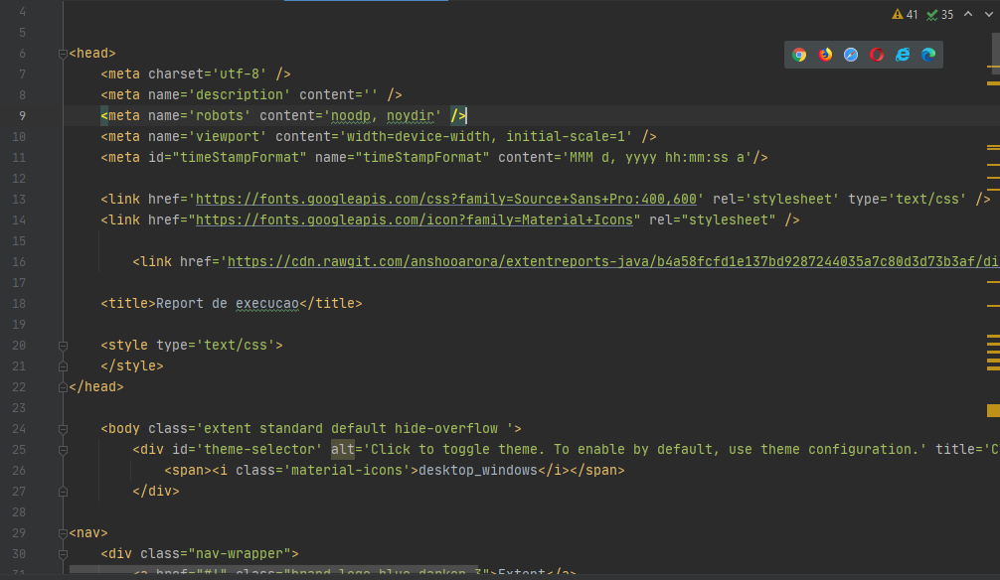

# Desafio de automação WEB SKY

## Detalhes do projeto

Foi realizada a automação web utilizando PageObject + Java + Cucumber + Extent Report + Selenium.

## Para abrir AutomacaoWeb.html na pasta evidência de report de execução indico utilizar a IDE Intellij. 
    
Report armazenado na pasta target/evidencia/

## Report de execução

Report armazenado na pasta target/evidencia/

## Deve adcionar o tilulo da programação no xpath dentro de page
# Markdown
@FindBy(xpath = "//h2[contains(text(),'Tá na Hora do Café')] ")
    WebElement programacao;
    
    
